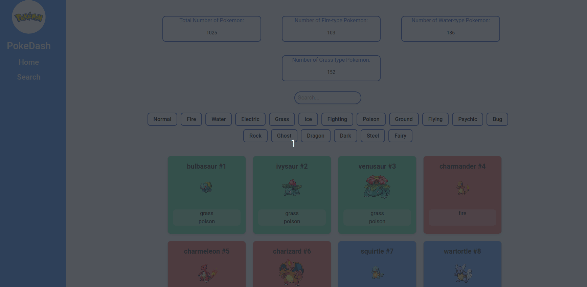
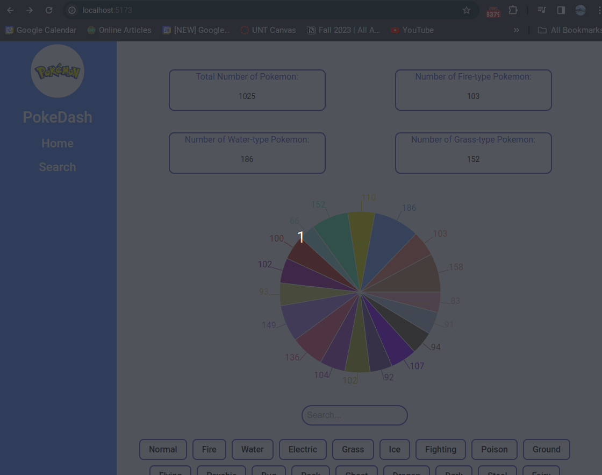

# Web Development Project 5 - *PokeDash*

Submitted by: **Dustin Ruiz**

This web app: **The app is a Pokémon database viewer that displays a list of Pokémon data including Pokémon name, ID, image, and typing from an API. It features a search bar for users to easily locate specific Pokémon, alongside multiple filter options enabling users to refine results by pokemon types. Additionally, the app dashboard presents three summary statistics, offering insights such as the total number of Pokémon, number of fire-type Pokemon, number of water-type Pokemon, and number of grass-type Pokemon.**

Time spent: **10** hours spent in total

## Required Features

The following **required** functionality is completed:

- [x] **The list displays a list of data fetched using an API call**
- [x] **Data uses the useEffect React hook and async/await syntax**
- [x] **The app dashboard includes at least three summary statistics about the data such as**
  - [x] total number of Pokémon
  - [x] number of fire-type Pokemon
  - [x] number of water-type Pokemon
  - [x] number of grass-type Pokemon
- [x] **A search bar allows the user to search for an item in the fetched data**
- [x] **Multiple different filters (2+) allow the user to filter items in the database by specified categories**

The following **optional** features are implemented:

- [ ] Multiple filters can be applied simultaneously
- [ ] Filters use different input types such as a text input, a selection, or a slider
- [ ] The user can enter specific bounds for filter values

The following **additional** features are implemented:

* [ ] List anything else that you added to improve the site's functionality!

## Video Walkthrough

Here's a walkthrough of implemented user stories:
- Note: Loading time for GIF may take some time to fully load.

<!-- Replace this with whatever GIF tool you used! -->
GIF created with [peek](https://github.com/phw/peek) for Linux. -->

## Notes

Describe any challenges encountered while building the app.
- Fetching the correct data from the Pokemon API was a consistent challenge.
- Figuring out how to effectively filter Pokemon based on different types presented another challenge.
- Creating a responsive interface that adapted to various screen sizes and integrated well with other components proved to be a challenge.

## License

    Copyright [2024] [Dustin Ruiz]

    Licensed under the Apache License, Version 2.0 (the "License");
    you may not use this file except in compliance with the License.
    You may obtain a copy of the License at

        http://www.apache.org/licenses/LICENSE-2.0

    Unless required by applicable law or agreed to in writing, software
    distributed under the License is distributed on an "AS IS" BASIS,
    WITHOUT WARRANTIES OR CONDITIONS OF ANY KIND, either express or implied.
    See the License for the specific language governing permissions and
    limitations under the License.

# Web Development Project 6 - *PokeDash*

Submitted by: **Dustin Ruiz**

This web app: **The app is a Pokemon database viewer that displays a list of Pokemon data. Implemented two new features in the Pokemon database viewer application. The first feature introduces data visualizations, such as a pie chart illustrating the distribution of Pokemon types. The second feature enables users to access information about each Pokemon. This detail view provides a description of the Pokemon, including its attributes, moves, and other relevant details.**

Time spent: **6** hours spent in total

## Required Features

The following **required** functionality is completed:

- [x] **The app includes at least one unique chart developed using the fetched data that tell an interesting story**
- [x] **Clicking on an item in the list view displays more details about it**
- [x] **Clicking on an item has a direct, unique link to that item's detail view page**

The following **optional** features are implemented:

- [ ] The site's customized dashboard contains more content that explains what is interesting about the data
- [ ] The site allows users to toggle between different data visualizations

The following **additional** features are implemented:

* [ ] List anything else that you added to improve the site's functionality!

## Video Walkthrough

Here's a walkthrough of implemented user stories:

- Note: Loading time for GIF may take some time to fully load.

<!-- Replace this with whatever GIF tool you used! -->
GIF created with [peek](https://github.com/phw/peek) for Linux. -->

## Notes

Describe any challenges encountered while building the app.
- The most challenging aspect was implementing the detailed view feature. It involved significant troubleshooting to retrieve the correct information from the APIs. 
- Additionally, working with React Router to create different pages with unique links to each item's detail view page was also difficult.

## License

    Copyright [2024] [Dustin Ruiz]

    Licensed under the Apache License, Version 2.0 (the "License");
    you may not use this file except in compliance with the License.
    You may obtain a copy of the License at

        http://www.apache.org/licenses/LICENSE-2.0

    Unless required by applicable law or agreed to in writing, software
    distributed under the License is distributed on an "AS IS" BASIS,
    WITHOUT WARRANTIES OR CONDITIONS OF ANY KIND, either express or implied.
    See the License for the specific language governing permissions and
    limitations under the License.